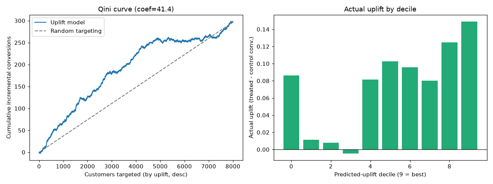

# Uplift Modeling — Who is *persuadable*?

Most marketing models predict **who will convert**. That's the wrong question for campaign targeting. The right question is **who converts *because of* the campaign** — the *persuadables* — so you don't waste budget on people who'd buy anyway, or annoy people the campaign actually pushes away.

This project builds an **uplift model** (a.k.a. true-lift / incremental-response model) with the **T-learner** approach and evaluates it with a **Qini curve**.

## The 4 customer types
| | Buys if **treated** | Doesn't buy if treated |
|---|---|---|
| **Buys if control** | 🟦 Sure Thing (don't waste $) | 🟥 Sleeping Dog (campaign *hurts*) |
| **Doesn't if control** | 🟩 **Persuadable** (target these!) | ⬜ Lost Cause (don't waste $) |

A conversion model targets Sure Things. An **uplift** model targets **Persuadables** and avoids **Sleeping Dogs**.

## Method
- **Data:** a synthetic but realistic **RCT** (randomized treatment) with a *known* heterogeneous treatment effect `tau(x)` — persuadables (mid-engagement) get a large positive lift; already-very-engaged customers are mild *sleeping dogs* (negative lift).
- **Model:** **T-learner** — two `GradientBoostingClassifier`s, one fit on the **treated** arm and one on the **control** arm. `uplift(x) = P(convert | x, treated) − P(convert | x, control)`.
- **Eval:** **Qini curve** (cumulative incremental conversions when targeting top-k by predicted uplift) and **actual uplift by decile** on a held-out set.

## Results (`python uplift_modeling.py`)
- **Qini coefficient ≈ 41** (area vs. random targeting; >0 ⇒ the model beats targeting at random).
- **Ranking works:** top-2 predicted-uplift deciles show **+0.137** actual uplift vs **+0.049** in the bottom-2 — i.e., concentrating spend on the model's top decile yields ~3× the incremental conversions of the bottom.



## Run
```bash
pip install -r requirements.txt
python uplift_modeling.py        # prints metrics + writes uplift_results.png
```

## Caveat (honest)
Uplift is *causal*: you never observe the same customer both treated and not, so individual uplift can't be measured directly — only **estimated**, and only well with **experimental (RCT) data**. Evaluation is therefore group-level (Qini/deciles), and uplift signals are inherently noisier than ordinary classification.

## Stack
Python · scikit-learn · pandas · numpy · matplotlib
